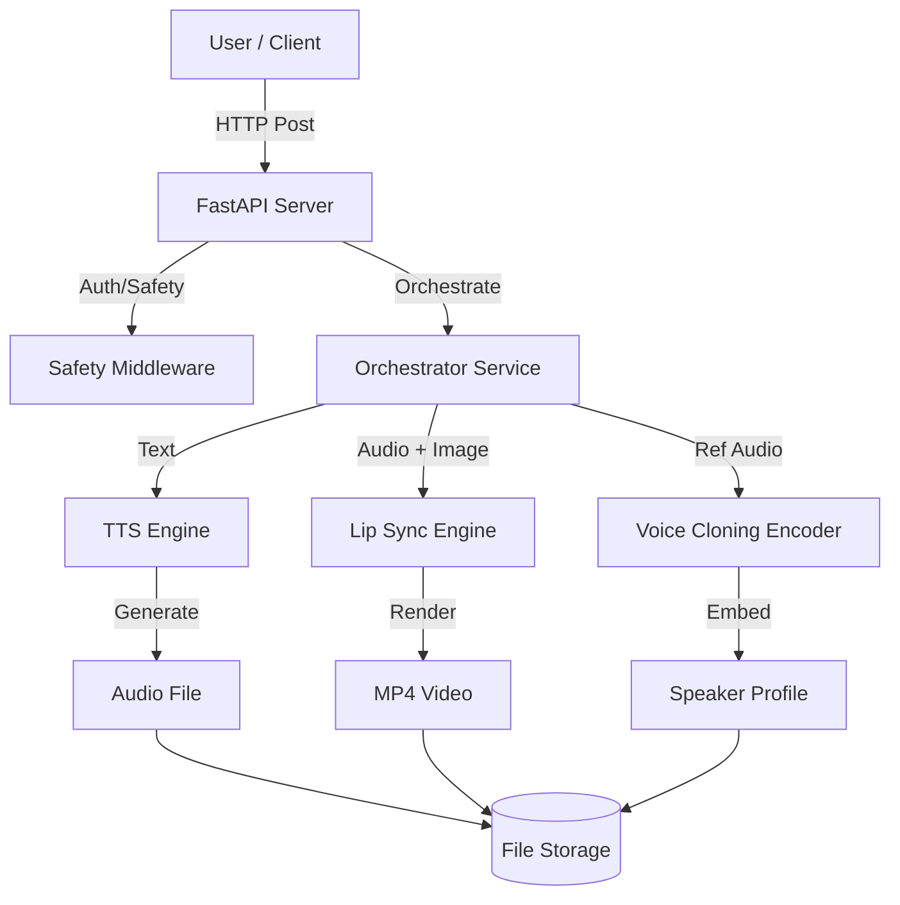

# System Architecture

## Overview
InteractGEN is a modular Text-to-Speech and Talking Head generation system. It consists of four main layers:

1.  **Presentation Layer**: a React-based frontend for user interaction.
2.  **API Layer**: A FastAPI backend that handles requests, orchestration, and security.
3.  **Core Models Layer**: Abstracted inference engines for TTS, Voice Cloning, and Lip Sync.
4.  **Storage Layer**: Local filesystem (extensible to S3) for storing profiles and generated media.

## Architecture Diagram (Mermaid)

## Module Descriptions

### 1. API (`/api`)
- **server.py**: Entry point.
- **routers**: `tts.py`, `animate.py`, `voice_cloning.py`.
- **services/orchestrator.py**: Manages the flow of data between models.

### 2. Core Models (`/core_models`)
- **base.py**: Abstract Base Classes ensuring modularity.
- **tts**: Implementation of Text-to-Speech (e.g., FastSpeech2).
- **lip_sync**: Implementation of Wav2Lip/SadTalker.
- **voice_cloning**: Speaker encoder for few-shot cloning.

### 3. Frontend (`/frontend`)
- React + Vite application.
- Uses Axios for API communication.
- Video preview and real-time status updates.
